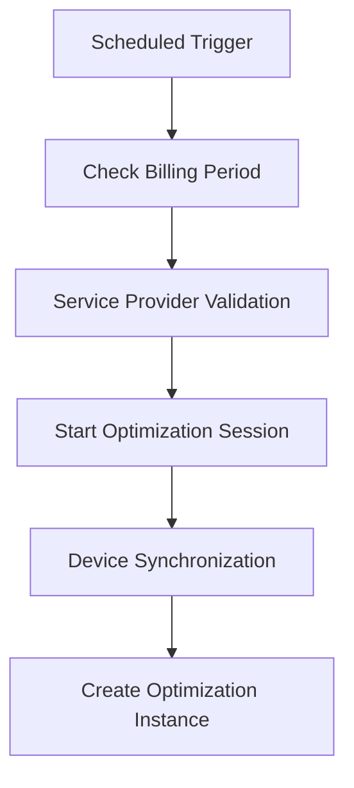
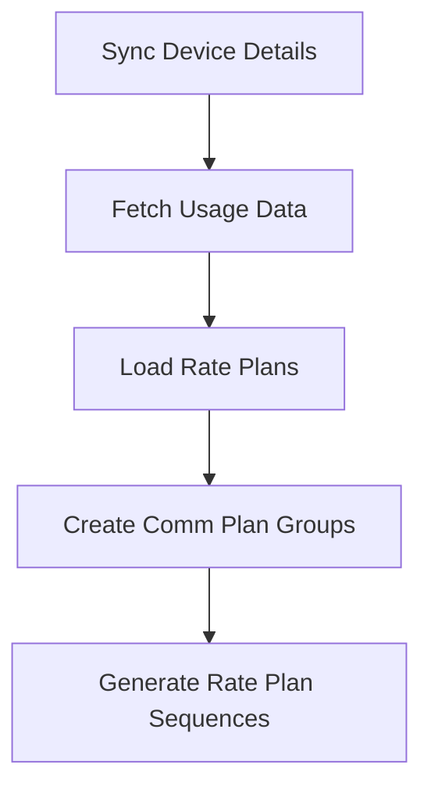
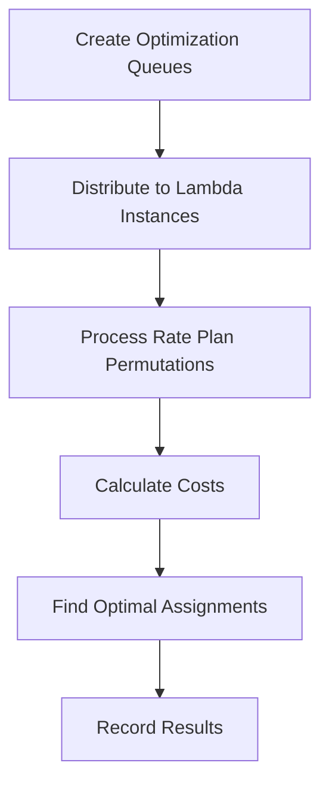
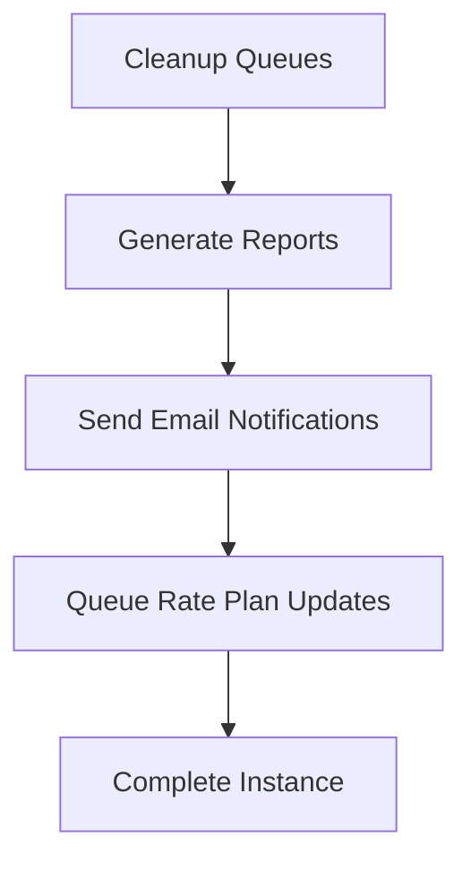

# Altaworx SIM Card Cost Optimization System

## Overview

The Altaworx SIM Card Cost Optimization System is a comprehensive AWS Lambda-based solution designed to optimize SIM card costs and carrier plan assignments for telecommunications providers. The system analyzes device usage patterns, billing periods, and rate plans to find the most cost-effective carrier plan assignments for M2M (Machine-to-Machine) and Mobility devices.

## Architecture

### Core Components

#### 1. **AltaworxSimCardCostOptimizer.cs**
- **Purpose**: Core optimization engine that processes optimization queues
- **Key Responsibilities**:
  - Processes SQS messages containing optimization queue IDs
  - Assigns SIM cards to optimal rate plans using various strategies
  - Handles both standard and chaining optimization processes
  - Manages Redis caching for optimization state persistence
  - Supports multiple portal types (M2M, Mobility, CrossProvider)

#### 2. **QueueCarrierPlanOptimization.cs**
- **Purpose**: Orchestrates the carrier plan optimization workflow
- **Key Responsibilities**:
  - Schedules optimization runs based on billing periods
  - Manages service provider configurations
  - Handles device synchronization triggers
  - Creates optimization instances and queues
  - Integrates with AMOP 2.0 API for progress tracking

#### 3. **AltaworxJasperAWSGetDevicesQueue.cs**
- **Purpose**: Synchronizes device data from Jasper API
- **Key Responsibilities**:
  - Fetches device information from Jasper API with pagination
  - Handles device staging and bulk data operations
  - Manages device usage synchronization
  - Implements retry policies for transient failures

#### 4. **AltaworxSimCardCostOptimizerCleanup.cs**
- **Purpose**: Finalizes optimization processes and sends results
- **Key Responsibilities**:
  - Cleans up optimization queues and instances
  - Generates result reports (Excel files)
  - Sends email notifications with optimization results
  - Handles rate plan update queuing
  - Manages customer optimization workflows

## Key Features

### 1. **Multi-Portal Support**
- **M2M (Machine-to-Machine)**: IoT devices and sensors
- **Mobility**: Mobile devices and cellular connections
- **CrossProvider**: Multi-carrier optimization scenarios

### 2. **Advanced Optimization Strategies**
- **SimCard Grouping Options**:
  - No Grouping: Individual device optimization
  - Group by Communication Plan: Optimizes devices with same comm plan together
- **Assignment Strategies**:
  - Largest to Smallest usage optimization
  - Smallest to Largest usage optimization
- **Charge Type Options**:
  - Rate Charge and Overage
  - Rate Charge Only
  - Overage Only

### 3. **Intelligent Scheduling**
- **Billing Period Awareness**: Runs optimization in the last 8 days of billing cycles
- **Time-based Triggers**: Configurable start times per service provider
- **Continuous Execution**: Allows multiple runs on the final day of billing period

### 4. **Resilience & Performance**
- **Redis Caching**: Improves performance and enables process continuation
- **Retry Policies**: Handles transient failures with exponential backoff
- **Bulk Operations**: Optimized SQL operations for large datasets
- **Parallel Processing**: Supports concurrent optimization queue processing

## Integration Points

### 1. **Jasper API Integration**
- **Device Synchronization**: Fetches device details and status
- **Usage Data**: Retrieves usage statistics for optimization
- **Rate Plan Updates**: Applies optimized rate plan assignments

### 2. **AMOP 2.0 API Integration**
- **Progress Tracking**: Real-time optimization progress updates
- **Error Handling**: Centralized error reporting and notifications
- **Customer Management**: Handles customer-specific optimization workflows

### 3. **AWS Services**
- **SQS**: Message queuing for asynchronous processing
- **Lambda**: Serverless execution environment
- **SES**: Email notifications for results and alerts
- **S3**: File storage for optimization results

## Database Schema

### Key Tables

#### OptimizationInstance
- Tracks individual optimization runs
- Links to service providers and billing periods
- Stores execution status and timing

#### OptimizationQueue
- Represents rate plan permutations for optimization
- Contains cost calculations and results
- Links to communication plan groups

#### OptimizationSimCard
- Maps SIM cards to optimization instances
- Stores device usage and cost data
- Tracks rate plan assignments

#### CommPlanGroup
- Groups communication plans for optimization
- Enables batch processing of related devices

## Configuration

### Environment Variables

```bash
# Queue URLs
WatchQueueURL=<SQS_QUEUE_URL>
DeviceSyncQueueURL=<SQS_QUEUE_URL>
CarrierOptimizationQueueURL=<SQS_QUEUE_URL>
OptimizationUsageQueueURL=<SQS_QUEUE_URL>
ExportDeviceUsageQueueURL=<SQS_QUEUE_URL>
RatePlanUpdateQueueURL=<SQS_QUEUE_URL>

# API Configuration
ProxyUrl=<AMOP_API_URL>
JasperDevicesGetPath=<JASPER_API_PATH>

# Processing Configuration
QueuesPerInstance=5
MaxPagesToProcess=100
SanityCheckTimeLimit=180
OptCustomerCleanUpDelaySeconds=300
CleanUpSendEmailRetryCount=3

# Notification Configuration
ErrorNotificationEmailReceiver=<EMAIL_ADDRESS>
```

### Service Provider Configuration
- **Integration Authentication**: API credentials for external services
- **Billing Period Settings**: Cycle end dates and time zones
- **Optimization Timing**: Start hours and execution preferences
- **Proration Settings**: Usage-based billing configurations

## Optimization Workflow

### 1. **Initialization Phase**


### 2. **Data Collection Phase**


### 3. **Optimization Phase**


### 4. **Finalization Phase**


## Rate Plan Optimization Algorithm

### 1. **Rate Pool Creation**
- **Input**: Rate plans, billing period, proration settings
- **Process**: Calculate maximum average usage per rate plan
- **Output**: Collection of rate pools with cost calculations

### 2. **SIM Card Assignment**
- **Strategies**:
  - **Greedy Assignment**: Assigns devices to lowest-cost rate plans first
  - **Usage-based Sorting**: Orders devices by data usage patterns
  - **Pool Balancing**: Distributes load across shared rate plans

### 3. **Cost Calculation**
- **Base Rate Charges**: Monthly recurring costs
- **Overage Charges**: Usage-based additional costs
- **Proration**: Partial billing period adjustments
- **Pooling Benefits**: Shared usage across multiple devices

## Error Handling & Monitoring

### 1. **Retry Mechanisms**
- **SQL Transient Retry**: 3 attempts with exponential backoff
- **HTTP Retry**: 3 attempts for API calls
- **General Retry**: 3 attempts for system operations

### 2. **Error Notifications**
- **Email Alerts**: Immediate notifications for critical errors
- **AMOP Integration**: Error status updates to central system
- **Logging**: Comprehensive logging for debugging

### 3. **Monitoring Points**
- **Queue Lengths**: SQS queue depth monitoring
- **Processing Times**: Lambda execution duration tracking
- **Error Rates**: Failed processing percentage
- **Cost Savings**: Optimization effectiveness metrics

## Security & Compliance

### 1. **Data Protection**
- **Encryption**: All data encrypted in transit and at rest
- **Access Controls**: IAM policies for AWS resources
- **Audit Logging**: Comprehensive operation tracking

### 2. **API Security**
- **Basic Authentication**: Jasper API credentials
- **Token-based Auth**: AMOP 2.0 API integration
- **Rate Limiting**: Prevents API abuse

## Performance Optimization

### 1. **Caching Strategy**
- **Redis Cache**: Optimization state persistence
- **SIM Card Caching**: Reduces database queries
- **Rate Plan Caching**: Improves calculation performance

### 2. **Database Optimization**
- **Bulk Operations**: Reduces transaction overhead
- **Stored Procedures**: Optimized database logic
- **Connection Pooling**: Efficient database connections

### 3. **Lambda Optimization**
- **Memory Allocation**: Optimized for processing requirements
- **Timeout Configuration**: Appropriate execution limits
- **Parallel Processing**: Concurrent queue processing

## Deployment & Operations

### 1. **Deployment Process**
1. Build and package Lambda functions
2. Deploy to AWS Lambda service
3. Configure environment variables
4. Set up SQS queues and triggers
5. Configure monitoring and alerts

### 2. **Monitoring & Maintenance**
- **CloudWatch Metrics**: Lambda execution metrics
- **SQS Monitoring**: Queue depth and processing rates
- **Error Tracking**: Exception logging and alerting
- **Performance Metrics**: Optimization effectiveness tracking

### 3. **Troubleshooting**
- **Log Analysis**: CloudWatch logs for debugging
- **Queue Inspection**: SQS message analysis
- **Database Queries**: Direct data validation
- **API Testing**: External service verification

## Cost Optimization Results

### 1. **Report Generation**
- **Excel Reports**: Detailed device assignment results
- **Summary Statistics**: Overall optimization effectiveness
- **Cost Comparisons**: Before/after optimization analysis

### 2. **Email Notifications**
- **Stakeholder Reports**: Business-friendly summaries
- **Technical Details**: Detailed execution information
- **Error Reports**: Issue notification and resolution

### 3. **Rate Plan Updates**
- **Automatic Updates**: Direct API rate plan changes
- **Manual Review**: Option for human approval
- **Rollback Capability**: Ability to revert changes

## Support & Maintenance

### 1. **Common Issues**
- **Cache Connectivity**: Redis connection failures
- **API Timeouts**: External service unavailability
- **Data Inconsistencies**: Sync failures between systems

### 2. **Maintenance Tasks**
- **Database Cleanup**: Remove old optimization data
- **Cache Maintenance**: Clear expired cache entries
- **Configuration Updates**: Update service provider settings

### 3. **Contact Information**
- **Technical Support**: [Contact details for technical issues]
- **Business Support**: [Contact details for business questions]
- **Emergency Contact**: [24/7 support contact information]

---

## Quick Start Guide

1. **Prerequisites**: AWS account with appropriate permissions
2. **Configuration**: Set up environment variables and service provider settings
3. **Deployment**: Deploy Lambda functions and configure triggers
4. **Testing**: Run optimization with test data
5. **Production**: Enable scheduled optimization runs

For detailed implementation guides and API documentation, refer to the specific component documentation files.