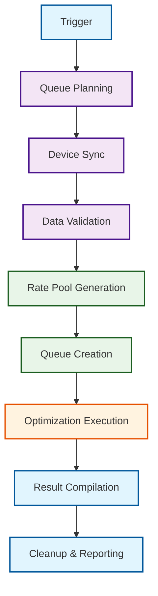
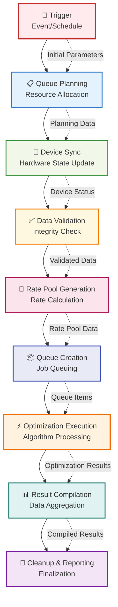

# Data Flow Diagram

## Overview
This document presents the data flow diagram for the system process that follows this sequence:
**Trigger → Queue Planning → Device Sync → Data Validation → Rate Pool Generation → Queue Creation → Optimization Execution → Result Compilation → Cleanup & Reporting**

## Mermaid Diagram



## Detailed Flow Diagram with Data Elements



## ASCII Text Diagram

```
┌─────────────────────────────────────────────────────────────────────────┐
│                          DATA FLOW DIAGRAM                             │
└─────────────────────────────────────────────────────────────────────────┘

    [Trigger]
        │
        │ Initial Parameters
        ▼
    [Queue Planning]
        │
        │ Planning Data
        ▼
    [Device Sync]
        │
        │ Device Status
        ▼
    [Data Validation]
        │
        │ Validated Data
        ▼
    [Rate Pool Generation]
        │
        │ Rate Pool Data
        ▼
    [Queue Creation]
        │
        │ Queue Items
        ▼
    [Optimization Execution]
        │
        │ Optimization Results
        ▼
    [Result Compilation]
        │
        │ Compiled Results
        ▼
    [Cleanup & Reporting]
```

## Process Description

### 1. **Trigger** 🚀
- **Input**: External event, schedule, or manual initiation
- **Output**: Initial parameters and system activation signal
- **Purpose**: Initiates the entire data processing pipeline

### 2. **Queue Planning** 📋
- **Input**: Initial parameters from trigger
- **Output**: Resource allocation plan and processing strategy
- **Purpose**: Determines resource requirements and processing approach

### 3. **Device Sync** 🔄
- **Input**: Planning data and device connectivity
- **Output**: Updated device status and synchronization confirmation
- **Purpose**: Ensures all devices are properly synchronized and ready

### 4. **Data Validation** ✅
- **Input**: Device status and raw data
- **Output**: Validated, clean data ready for processing
- **Purpose**: Ensures data integrity and quality before processing

### 5. **Rate Pool Generation** 🌊
- **Input**: Validated data and rate calculation parameters
- **Output**: Generated rate pools and calculation results
- **Purpose**: Creates rate pools based on validated data

### 6. **Queue Creation** 📦
- **Input**: Rate pool data and processing requirements
- **Output**: Organized job queues ready for execution
- **Purpose**: Organizes work items into optimized processing queues

### 7. **Optimization Execution** ⚡
- **Input**: Queued jobs and optimization algorithms
- **Output**: Processed optimization results
- **Purpose**: Executes core optimization algorithms on queued data

### 8. **Result Compilation** 📊
- **Input**: Raw optimization results from multiple sources
- **Output**: Aggregated and formatted results
- **Purpose**: Combines and formats all processing results

### 9. **Cleanup & Reporting** 🧹
- **Input**: Compiled results and system state
- **Output**: Final reports and clean system state
- **Purpose**: Finalizes the process and prepares comprehensive reports

## Data Flow Characteristics

- **Linear Flow**: Each step depends on the successful completion of the previous step
- **Data Transformation**: Each stage transforms and enriches the data
- **Validation Points**: Multiple validation checkpoints ensure data quality
- **Resource Management**: Queue planning and creation optimize resource utilization
- **Error Handling**: Each stage should include appropriate error handling and rollback mechanisms

## System Integration Points

- **External Triggers**: System can be initiated by various trigger types
- **Device Integration**: Hardware synchronization ensures consistent state
- **Data Processing**: Multiple validation and transformation stages
- **Optimization Engine**: Core algorithmic processing component
- **Reporting Interface**: Final output and system state reporting